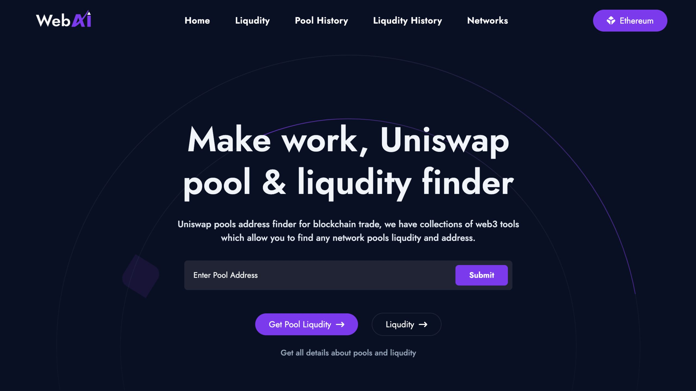

# Uniswap Pool & Liquidity Finder



## Overview

A decentralized web3 tool that allows users to find and analyze Uniswap V3 pool addresses and liquidity details across multiple blockchain networks. Built with Next.js, Ethers.js, and Uniswap V3 SDK.

## Features

- 🔍 Find Uniswap V3 pool addresses using token pairs and fee tiers
- 💧 View detailed liquidity information for any pool
- 🌐 Multi-network support (Ethereum, Polygon, Goerli, etc.)
- 📋 Copy-to-clipboard functionality for addresses
- 📱 Responsive design for all devices
- 🔄 Local storage for pool and liquidity history

## Getting Started

1. Clone the repository
   
```bash
git clone https://github.com/pri-3x/DeFi
```
2. Install dependencies:

```bash
npm install
```
3.Start the development server:
 ```bash
    npm run dev
```
The application will be available at `http://localhost:3000`
